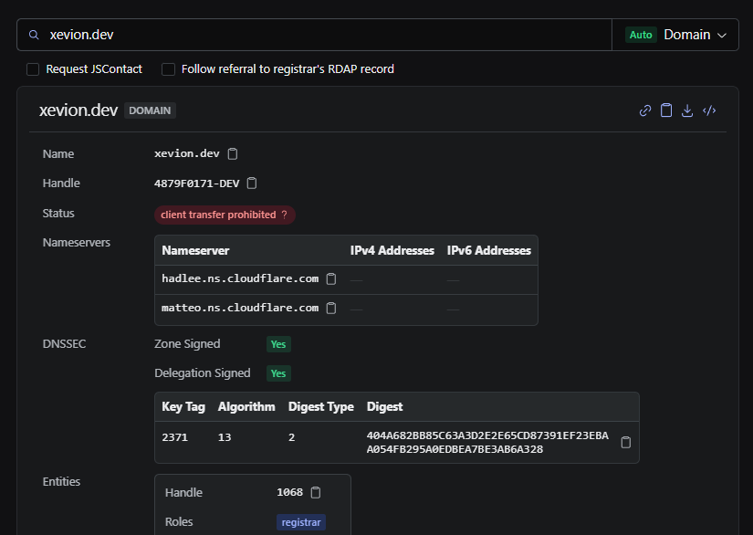
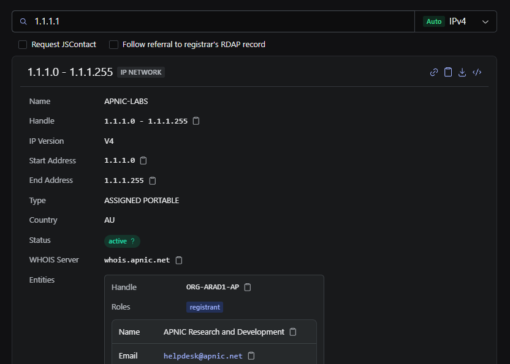

# rdap

[![Version][badge-version]][npm]
[![License][badge-license]][license]
[![CI][badge-ci]][ci-workflow]
[![Codecov][badge-codecov]][codecov]
[![TypeScript][badge-typescript]][typescript]
[![Next.js][badge-nextjs]][nextjs]
[![React][badge-react]][react]

[badge-version]: https://img.shields.io/badge/version-0.9.0-blue
[badge-license]: https://img.shields.io/badge/license-MIT-green
[badge-ci]: https://github.com/Xevion/rdap/actions/workflows/ci.yml/badge.svg
[badge-codecov]: https://codecov.io/gh/Xevion/rdap/branch/master/graph/badge.svg
[badge-typescript]: https://img.shields.io/badge/TypeScript-5.9-blue
[badge-nextjs]: https://img.shields.io/badge/Next.js-15.5-black
[badge-react]: https://img.shields.io/badge/React-19.2-blue

A modern RDAP query client built with Next.js and React. Query domains, IP addresses, ASNs, and more. Now with **dark mode**.

[][live-demo]
[][live-demo]

> [!TIP]
> **Try the live demo at [rdap.xevion.dev][live-demo]** to query domains, IPs, ASNs, and more in real-time.

## What is RDAP?

RDAP (Registration Data Access Protocol) is the modern successor to WHOIS, providing structured, machine-readable access to domain registration and network resource data. Instead of parsing inconsistent text output, RDAP delivers standardized JSON responses with richer metadata.

## Why?

The tool hosted by [rdap.org][rdap-client] is fantastic, but it's too simple, and isn't as overly-complicated and annoying as I want it to be. So, I built my own. **Mine has dark mode.**

Inspired by the [rdap.org client][rdap-client], this project adds several features I wanted:

- **🌙 Dark Mode**: Because the blistering white of other RDAP clients is painful to look at
- **🔗 Shareable Links**: Every query generates a unique URL you can bookmark or share
- **🎨 Modern Interface**: Intuitive type detection, status badges, and responsive design
- **📊 Rich Data Display**: Comprehensive support for all RDAP entity types, DNSSEC, JSContact, vCard, and more
- **⚡ Advanced Features**: Follow referrals to registrars, modern JSContact format support, export/copy JSON responses
- **🏠 Self-Hostable**: Static site that you can deploy anywhere for complete control

## Features

### Query Capabilities

- **Multiple Input Types**: IPv4/IPv6 (with CIDR notation), domain names, TLDs, ASNs, entity handles, or raw RDAP URLs
- **Smart Auto-Detection**: Automatically identifies query types with visual feedback
- **Manual Override**: Lock query type when auto-detection isn't enough
- **Follow Referrals**: Automatically follows redirects to registrar RDAP servers for complete data
- **JSContact Support**: Modern JSContact (RFC 9553) format alongside traditional vCard

### Supported Entity Types

Full rendering support for all RDAP object classes:

- **Domains**: Name, status, nameservers, DNSSEC, registrar info, creation/expiry dates
- **IP Networks**: IPv4/IPv6 ranges, allocation dates, network types, parent/child relationships
- **Autonomous Systems**: AS numbers, names, registration details
- **Entities**: Contacts, registrars, registrants with role information and public IDs
- **Nameservers**: Hostnames with IPv4/IPv6 address mappings

### Contact Information

- **Dual Format Support**: Both legacy vCard (jCard) and modern JSContact (RFC 9553)
- **Rich Contact Data**: Names, organizations, emails, phone numbers, addresses, URLs, titles, and roles
- **Structured Display**: Clean presentation of hierarchical contact information

### DNS Security (DNSSEC)

- Zone signing and delegation status indicators
- DS (Delegation Signer) records with key tags, algorithms, digest types
- DNSKEY records with flags, protocols, and public keys
- Maximum signature lifetime display

### User Experience

- **🎨 Theme Toggle**: Full dark mode and light mode support with persistence
- **📋 Data Export**: Copy individual values, entire JSON responses, or download as files
- **🔍 Raw View Toggle**: Switch between formatted display and raw JSON
- **📊 Status Badges**: Interactive badges for 28+ RDAP status types with hover definitions
- **⏱️ Relative Timestamps**: Human-readable event times with precise date fallback
- **📱 Responsive Design**: Mobile-first layout that adapts from phone to desktop

### Error Handling & Validation

- **Comprehensive HTTP Error Messages**: Clear explanations for 302, 400, 403, 404, 500 responses
- **Input Validation**: Type checking with helpful warnings when manual type doesn't match input
- **Schema Validation**: Zod-based validation with readable error messages
- **Bootstrap Integration**: Automatic IANA registry bootstrap for URL resolution

### Technical Details

- **Registry Bootstrap**: Automatic fetching from IANA bootstrap files (DNS, IPv4, IPv6, ASN, object tags)
- **CIDR Matching**: Proper network range matching for IP lookups
- **Internationalization**: Full Unicode domain name support
- **Type Safety**: Comprehensive TypeScript types inferred from Zod schemas
- **Static Site**: No backend required for basic usage, fully client-side queries

## Installation & Usage

This project uses [pnpm][pnpm] as its package manager. Make sure you have [Node.js][nodejs] installed, then run:

```bash
# Install dependencies
pnpm install

# Run development server
pnpm dev

# Build for production
pnpm build

# Start production server
pnpm start
```

The development server will be available at `http://localhost:3000`.

### Additional Commands

```bash
# Run tests
pnpm test

# Run tests with UI
pnpm test:ui

# Type checking
pnpm type-check

# Linting
pnpm lint
pnpm lint:fix

# Code formatting
pnpm format
pnpm format:check
```

## Tech Stack

- **[Next.js 15][nextjs]**: React framework with static site generation (SSG only)
- **[React 19][react]**: UI library with modern hooks
- **[TypeScript 5.9][typescript]**: Type-safe development
- **[Radix UI Themes][radix]**: Accessible component primitives and design system
- **[Tailwind CSS 4][tailwind]**: Utility-first styling
- **[Zod 4][zod]**: Runtime schema validation
- **[Vitest][vitest]**: Fast unit testing framework
- **[next-themes][next-themes]**: Theme management

## Self-Hosting

This is a **fully static site** with no backend required for basic usage. It generates all HTML at build time and queries RDAP servers directly from your browser.

**Key characteristics**:

- ✅ All RDAP queries made directly from your browser to source servers
- ✅ No intermediary servers logging your lookups
- ✅ Minimal local storage (theme preference only)
- ✅ Fully self-hostable for complete control

**Note on CORS**: Some RDAP servers don't enable CORS headers, preventing direct browser access. For these servers, you'll see an error. Future versions may include an optional proxy for these cases.

To self-host:

```bash
# Build the static site
pnpm build
```

## Contributing

Issues and pull requests are welcome! This project uses:

- **ESLint** for linting
- **Prettier** for code formatting
- **Husky** for git hooks
- **Conventional Commits** for commit messages

## License

[MIT License][license] © 2025 Ryan Walters

<!-- Links -->

[live-demo]: https://rdap.xevion.dev
[rdap-client]: https://client.rdap.org
[ci-workflow]: https://github.com/Xevion/rdap/actions/workflows/ci.yml
[codecov]: https://codecov.io/gh/Xevion/rdap
[pnpm]: https://pnpm.io/
[nodejs]: https://nodejs.org
[nextjs]: https://nextjs.org
[react]: https://react.dev
[typescript]: https://www.typescriptlang.org
[radix]: https://www.radix-ui.com
[tailwind]: https://tailwindcss.com
[zod]: https://zod.dev
[vitest]: https://vitest.dev
[next-themes]: https://github.com/pacocoursey/next-themes
[license]: LICENSE
[npm]: https://www.npmjs.com/package/rdap
